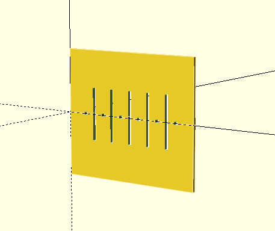

# Telar paramétrico
Hecho con OpenSCAD 2025



``` scad

cantidadUrdimbre = 10;
separacion = 3;
borde = 5;
grosorRendijas = 1;
alturaRendijas = 8;

union(){
    difference(){
        cube([borde*2+separacion*(cantidadUrdimbre-1)+grosorRendijas,1,alturaRendijas+borde*2]);
        for(i=[0:(cantidadUrdimbre-1)]){
            translate([i*separacion + borde,-0.5,-0.5]) {
            if (i % 2 == 0) cube([grosorRendijas,3,grosorRendijas]);
                else cube([grosorRendijas,3,alturaRendijas]);
            }
        }
    }
}
mirror([0,0,1]){
    difference(){
        cube([borde*2+separacion*(cantidadUrdimbre-1)+grosorRendijas,1,alturaRendijas+borde*2]);
        for(i=[0:(cantidadUrdimbre-1)]){
            translate([i*separacion + borde,-0.5,-0.5]) {
            if (i % 2 == 0) cube([grosorRendijas,3,grosorRendijas]);
                else cube([grosorRendijas,3,alturaRendijas]);
            }
        }
    }
}

```


>desarrollado y documentado por [AndresMartinM](https://github.com/AndresMartinM) 2025